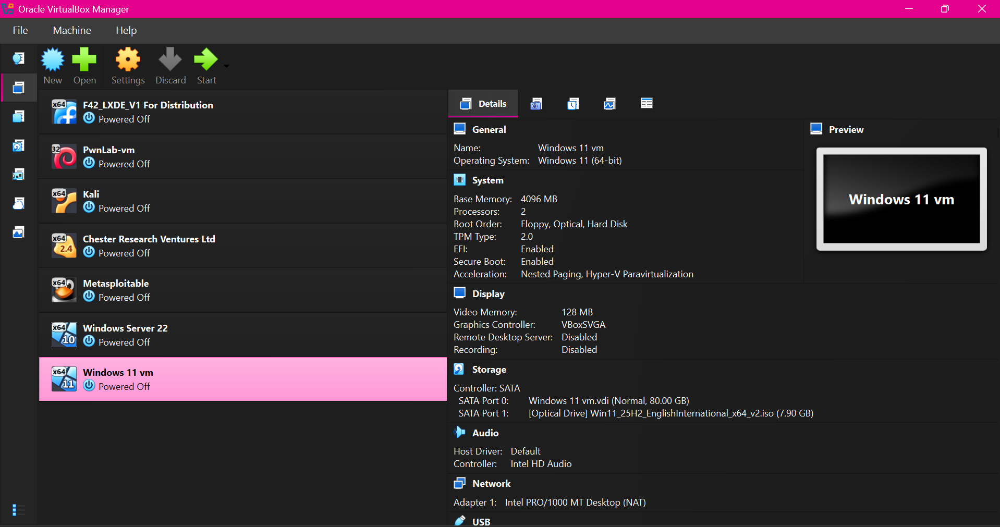
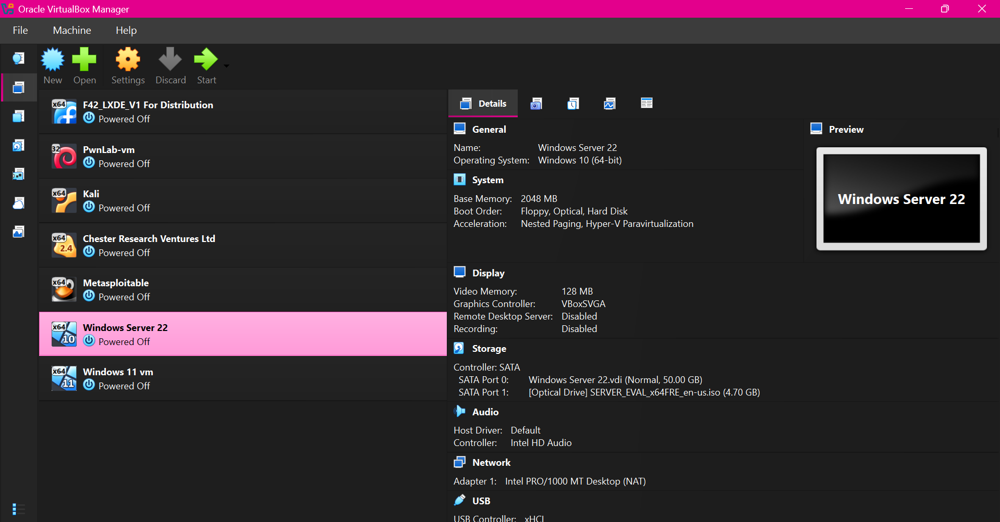
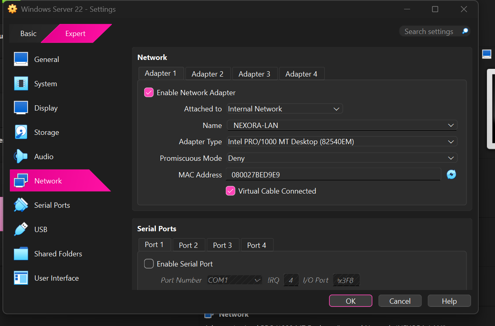
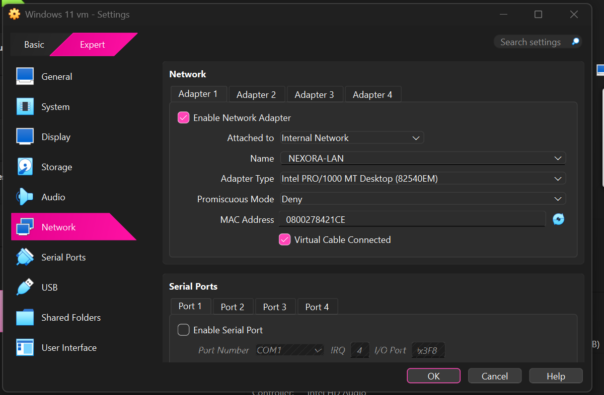
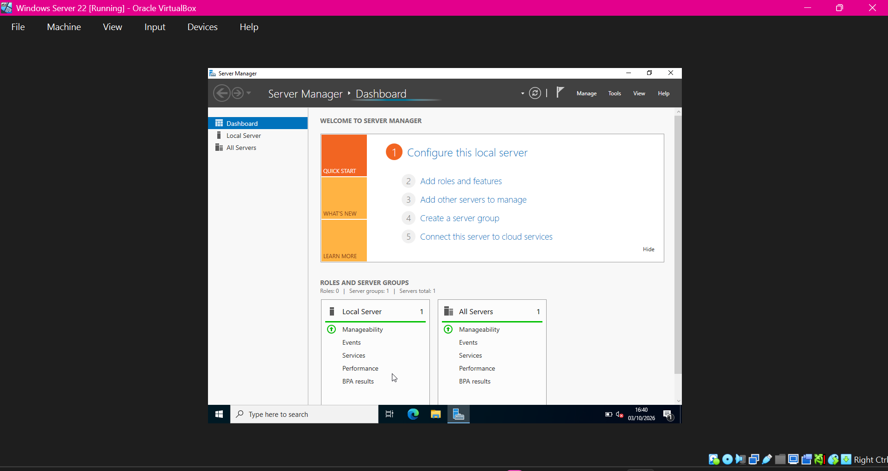
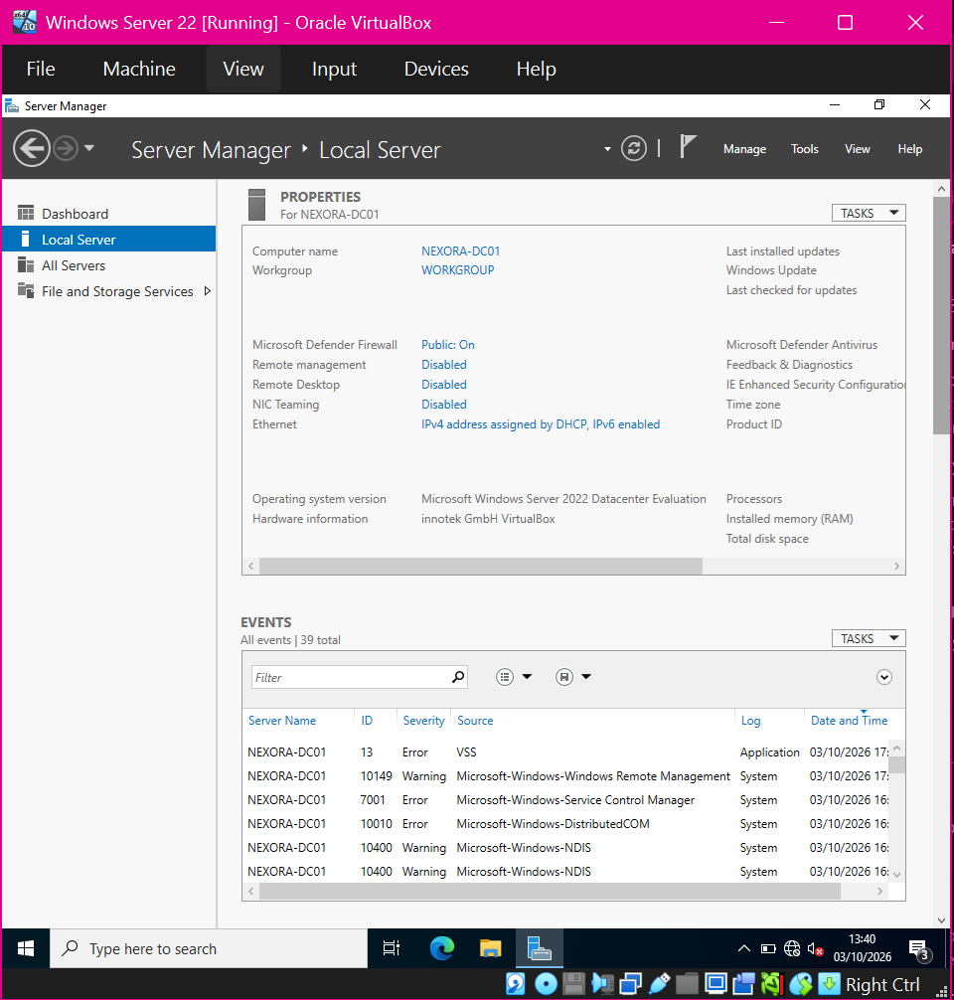
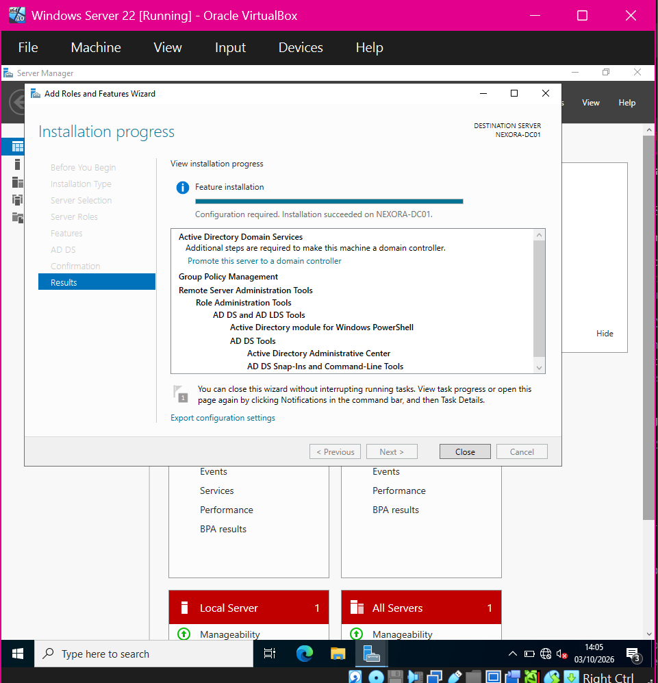
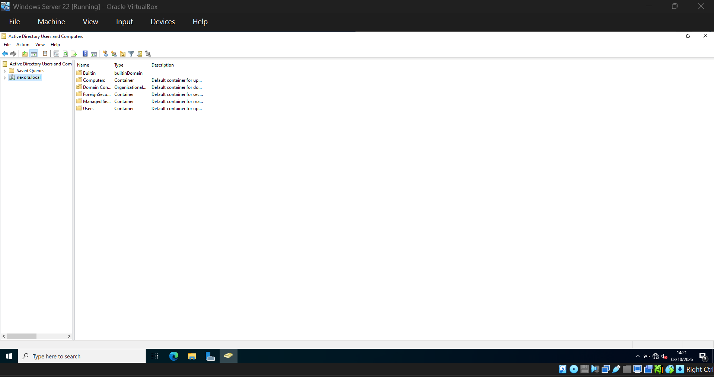
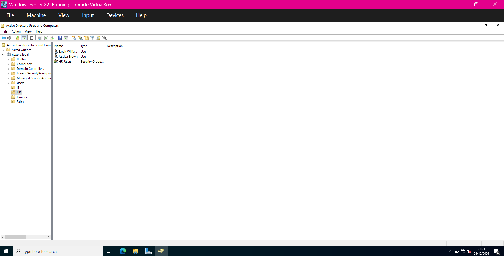

# Build the Windows domain lab

The sequence shows preparation, AD DS installation and the resulting domain. Initial VirtualBox OS labels describe the VM profile; the later Server Manager screen identifies Windows Server 2022.

## 1. Prepare the Windows 11 VM

VirtualBox shows the client VM resources and installation media; its adapter was initially NAT.

## 2. Prepare the server VM

The server VM is configured with its disk and installation media.

## 3. Set the server internal network

The server adapter is configured for the internal network NEXORA-LAN.

## 4. Set the client internal network

The client uses the same NEXORA-LAN internal network.

## 5. Open Server Manager

The installed server reaches the Server Manager dashboard.

## 6. Verify the server name and operating system

Local Server identifies NEXORA-DC01 and Windows Server 2022 Datacenter Evaluation.

## 7. Install Active Directory Domain Services

The role installation succeeded. This screen still requires promotion to a domain controller.

## 8. Verify the resulting domain

Active Directory Users and Computers shows nexora.local after domain setup.

## 9. Organise users and groups

Department OUs and the HR users/security group are visible.

