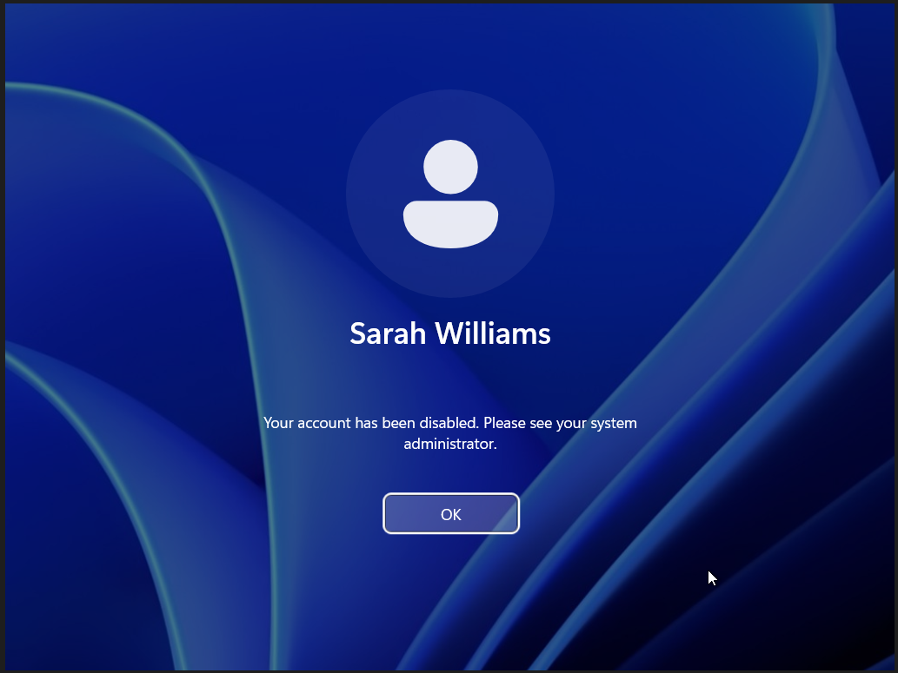
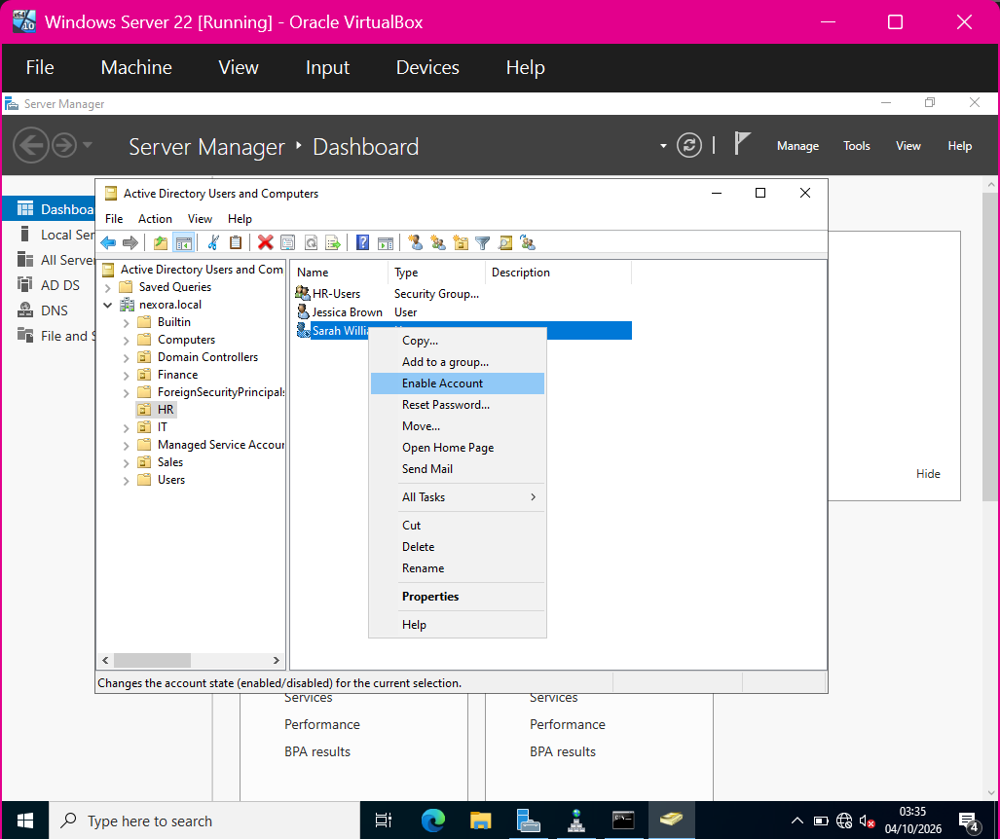
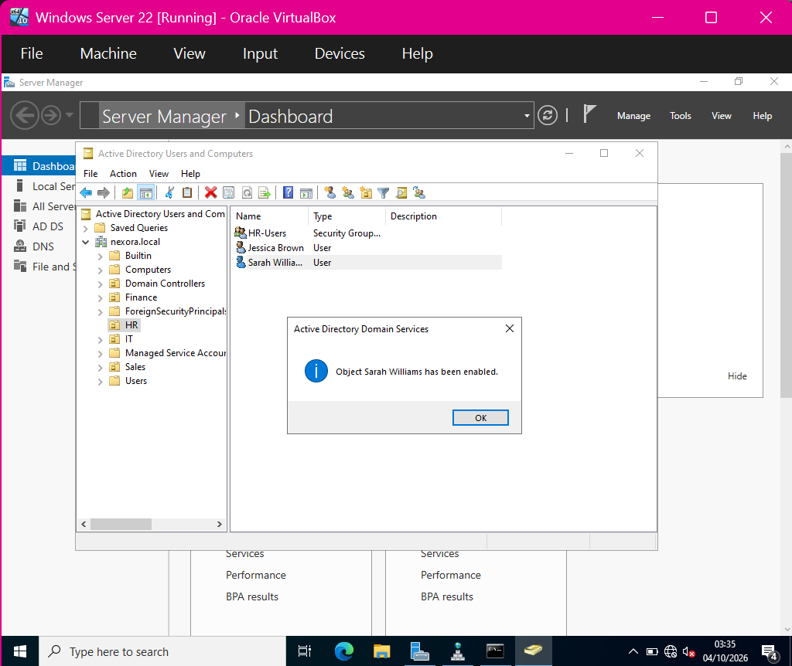
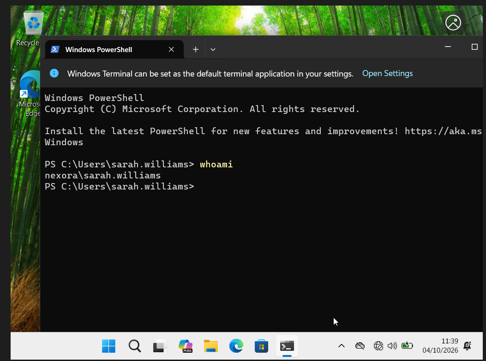

# Disable and restore a domain account

This sequence shows a blocked Windows sign-in, the administrative recovery action, its confirmation and a subsequent domain-user session.

## 1. Observe the disabled-account sign-in

Windows reports that Sarah's account has been disabled.

## 2. Select Enable Account

The administrator selects the Enable Account action in Active Directory Users and Computers.

## 3. Verify administrative success

Active Directory confirms that Sarah Williams has been enabled.

## 4. Verify the user session

After recovery, whoami returns nexora\sarah.williams.

