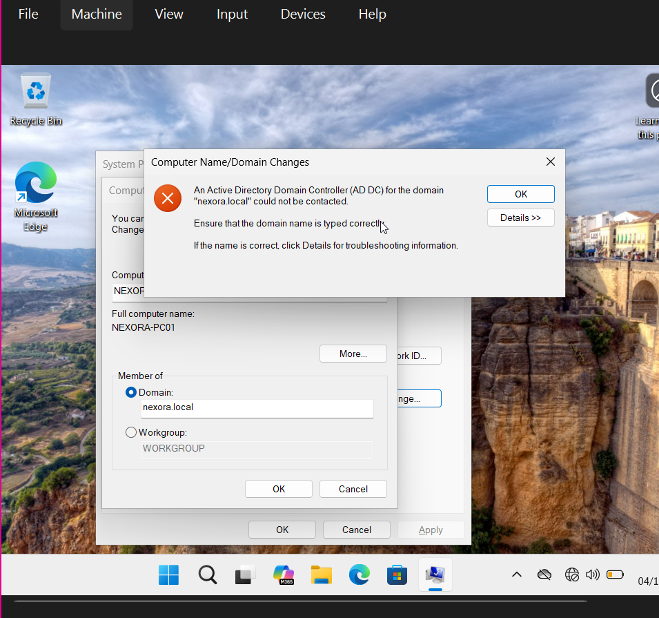
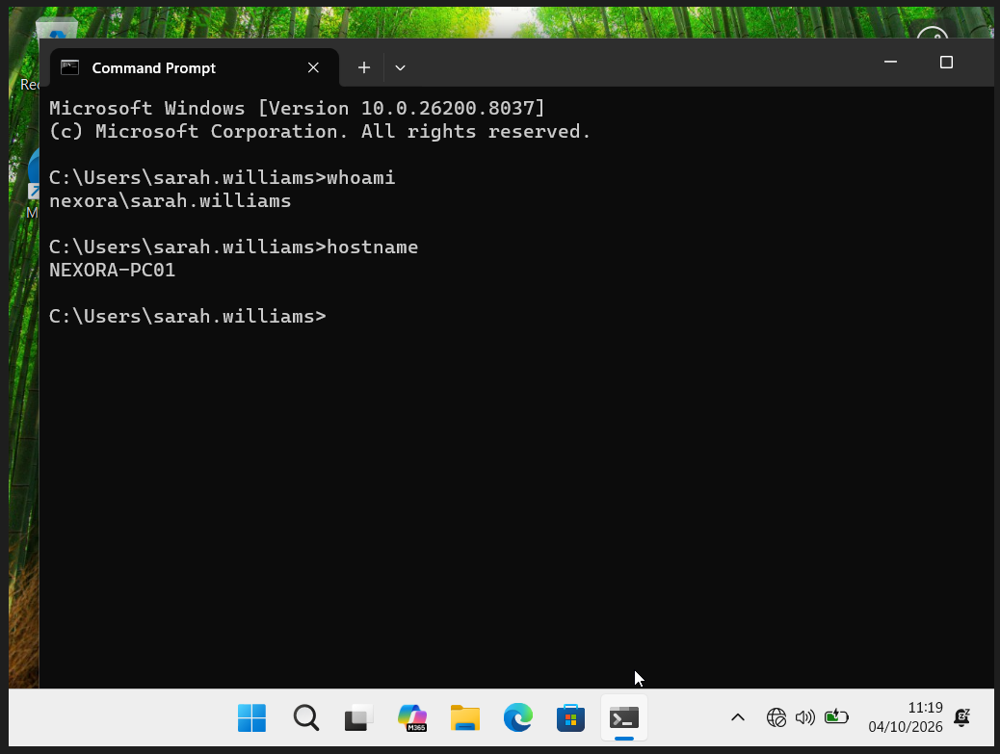

# Join Windows 11 to the domain

The initial domain-controller discovery failure leads into DNS investigation, then a successful join and domain-user verification. The DNS investigation has its own detailed sequence.

## 1. Observe the failed join

The client could not contact an Active Directory domain controller for nexora.local.

## 2. Confirm the successful join

The client receives Welcome to the nexora.local domain.

## 3. Verify user and workstation

whoami returns nexora\sarah.williams and hostname returns NEXORA-PC01.

