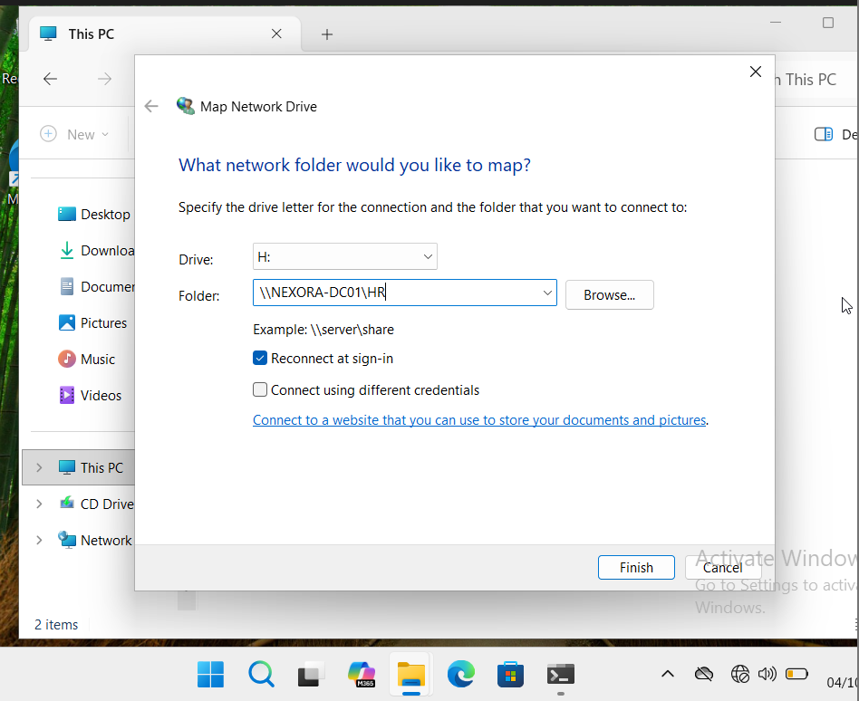
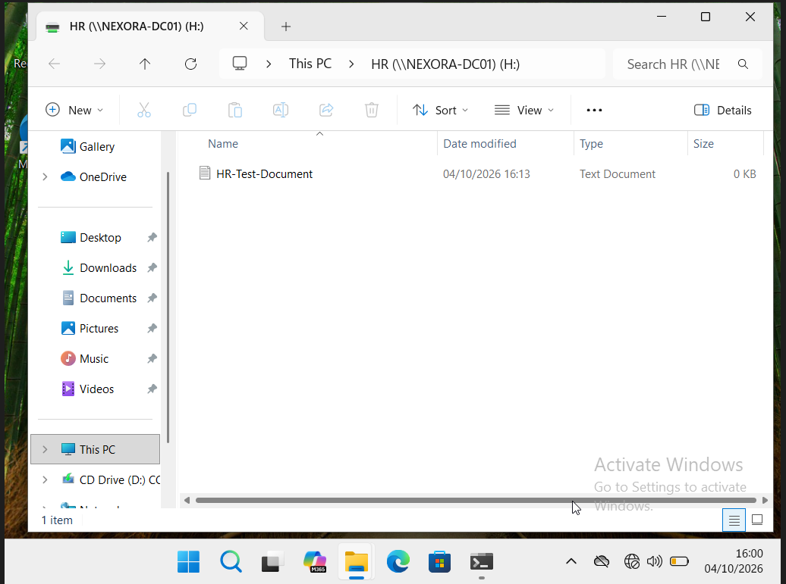

# Map and verify the HR shared drive

The earlier lab record documents HR-Users receiving NTFS Modify permission on C:\CompanyShares\HR. These supplied images show the mapping configuration and the resulting drive, rather than the permission editor.

## 1. Configure the drive mapping

Drive H: points to \\NEXORA-DC01\HR, with Reconnect at sign-in selected.

## 2. Verify the mapped drive and test file

File Explorer opens the HR share as H: and shows HR-Test-Document. The file is 0 KB; this supports file creation, not evidence of writing non-empty contents.

