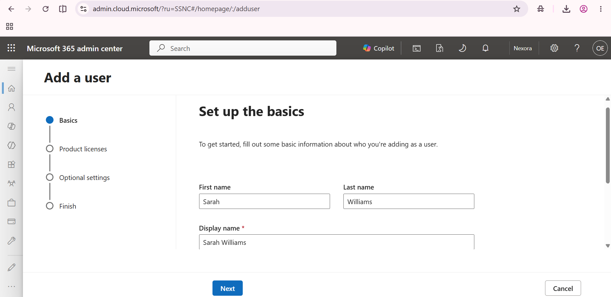
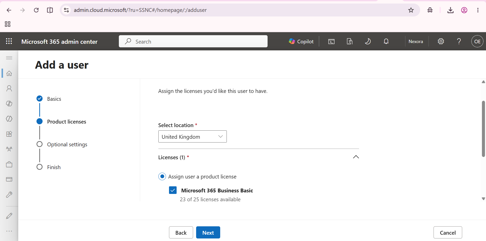
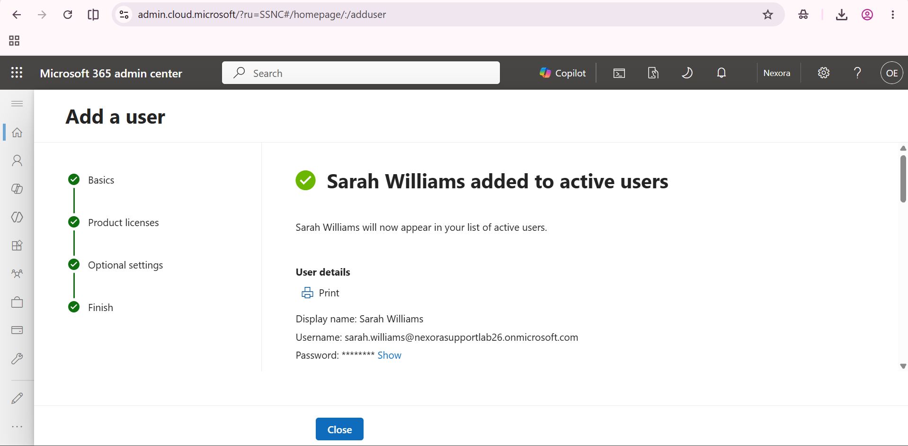

# Create and license a Microsoft 365 lab user

The sequence follows Sarah's account details through licence selection to successful creation. The screenshots show a separate cloud test account, not synchronisation with on-premises AD.

## 1. Enter the user details

The Add a user workflow contains Sarah Williams's name.

## 2. Select the product licence

Microsoft 365 Business Basic is selected with usage location United Kingdom.

## 3. Verify account creation

The admin centre confirms that Sarah Williams was added to active users; the password remains hidden.

