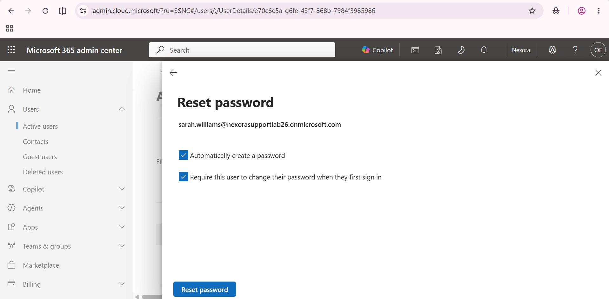
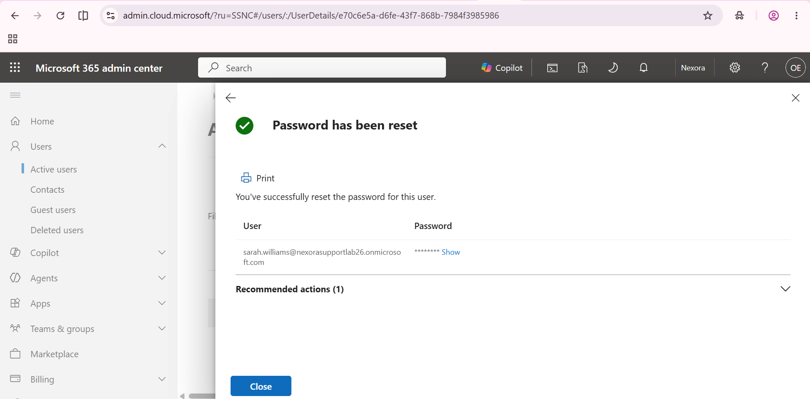

# Reset the Microsoft 365 password

Document the account selection, reset options and administrative success.

## 1. Set the reset options

Automatically create a password and require a password change at first sign-in are selected.

## 2. Verify the reset

The admin centre confirms Password has been reset. The password is hidden; subsequent cloud sign-in is not shown.

