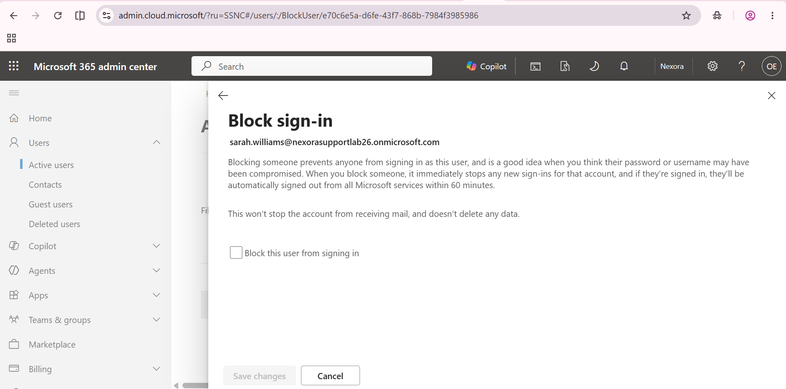
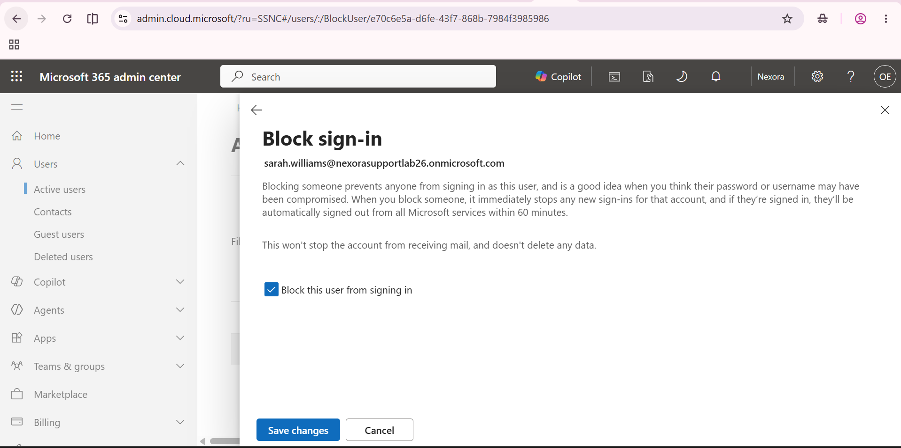
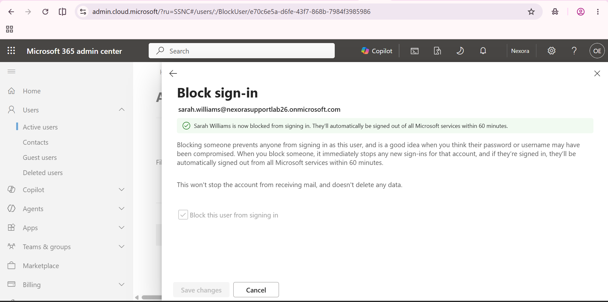
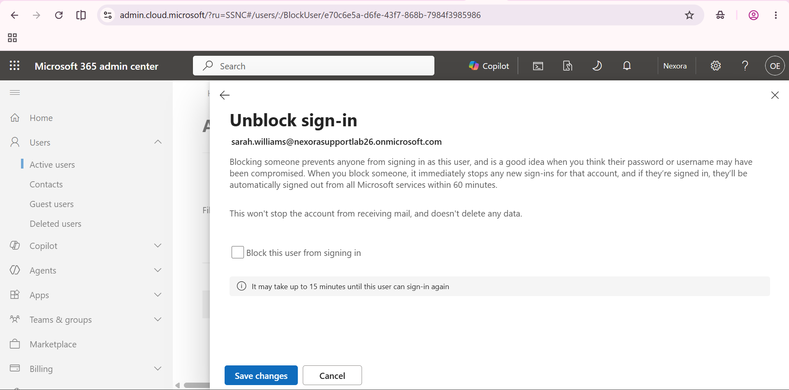
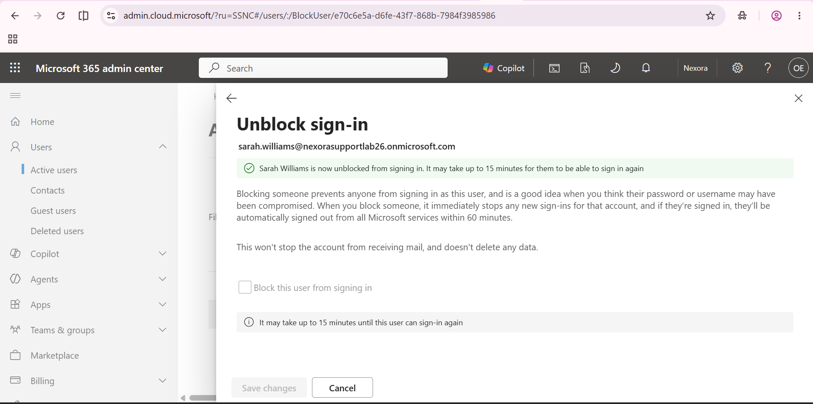

# Block and restore cloud sign-in

The sequence includes both the block and its reversal, leaving the test account administratively unblocked.

## 1. Review the initial setting

Block this user from signing in is initially unchecked.

## 2. Select the block setting

The checkbox is selected before saving.

## 3. Verify the block

The success banner confirms that Sarah is now blocked from signing in.

## 4. Prepare the reversal

The block checkbox is cleared in the Unblock sign-in workflow.

## 5. Verify the unblock

The success banner confirms Sarah is unblocked and notes that propagation can take up to 15 minutes. It does not show an actual sign-in test.

