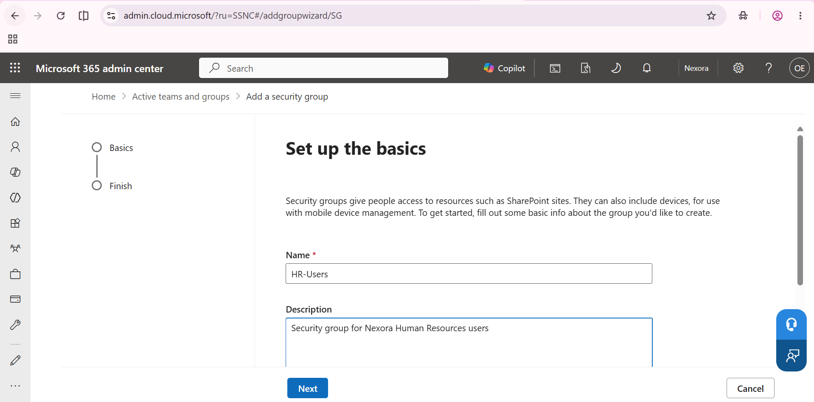
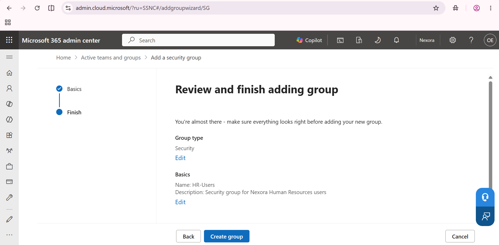
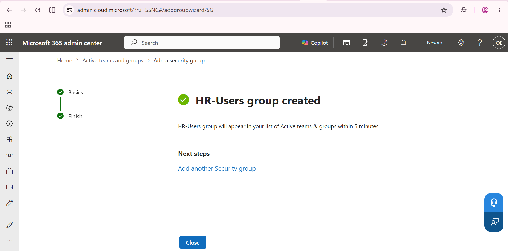
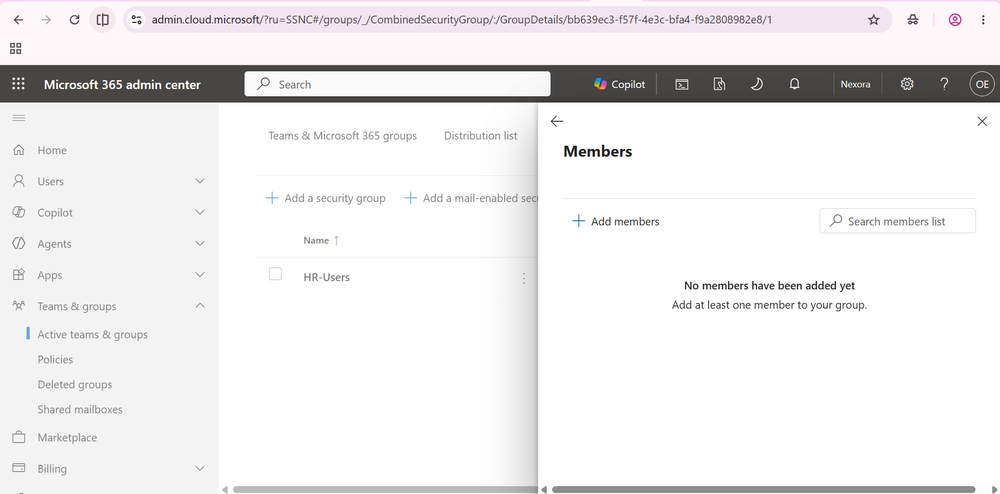
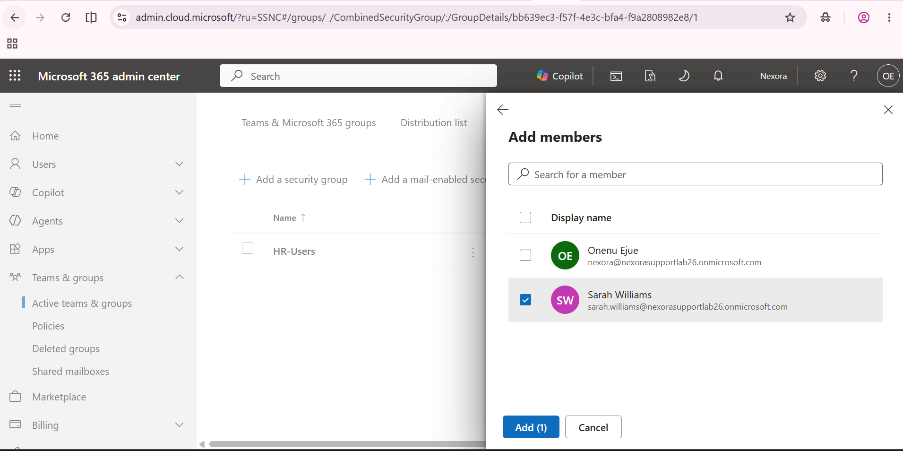
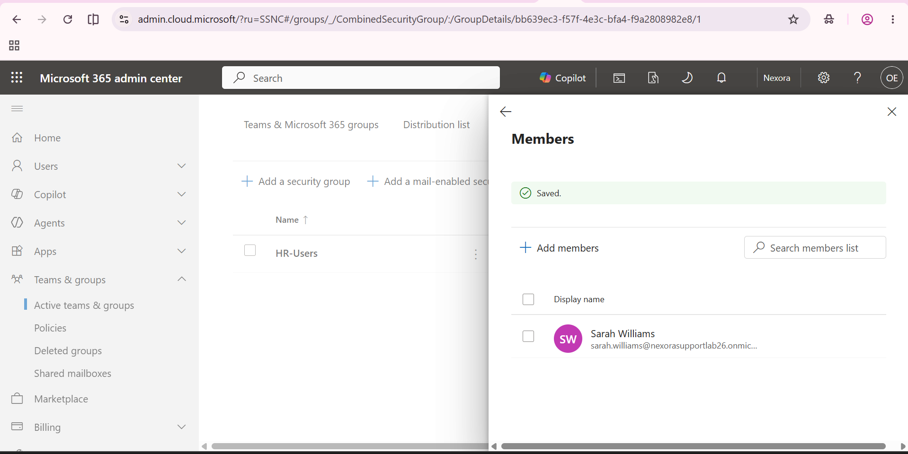
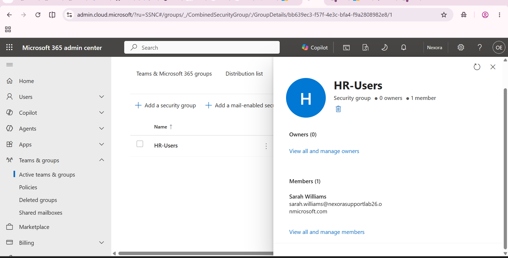

# Create a security group and add a member

The cloud HR-Users group is separate from the on-premises group of the same name.

## 1. Enter the group details

HR-Users has a description identifying its lab HR purpose.

## 2. Review the group type

The review page specifies Security and the HR-Users name.

## 3. Verify group creation

The admin centre confirms HR-Users group created.

## 4. Inspect the initial membership

The group initially has no members.

## 5. Select Sarah

Sarah Williams is selected for addition.

## 6. Verify the saved membership

The Saved banner appears and Sarah is listed as a member.

## 7. Verify the final group summary

HR-Users shows one member, Sarah Williams.

