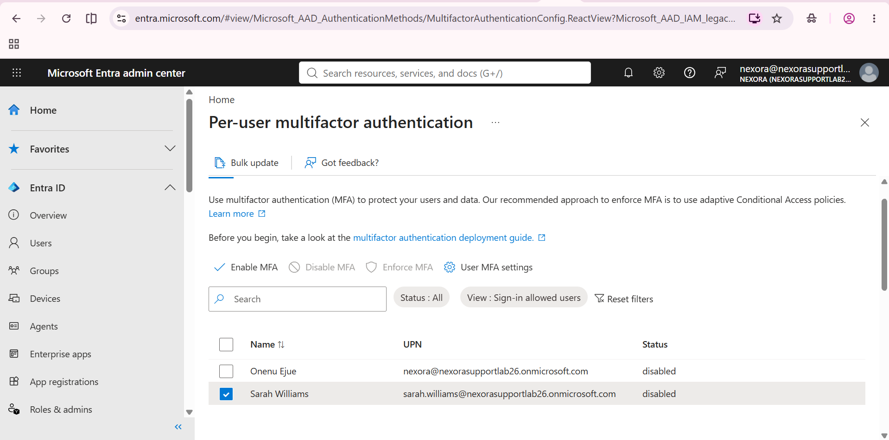
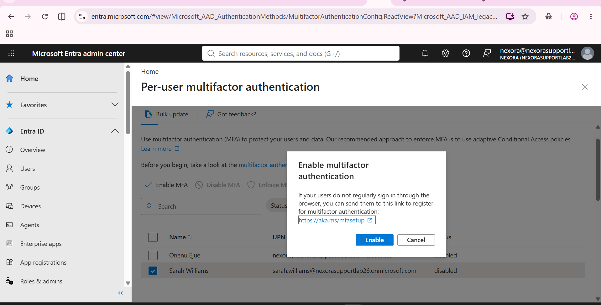
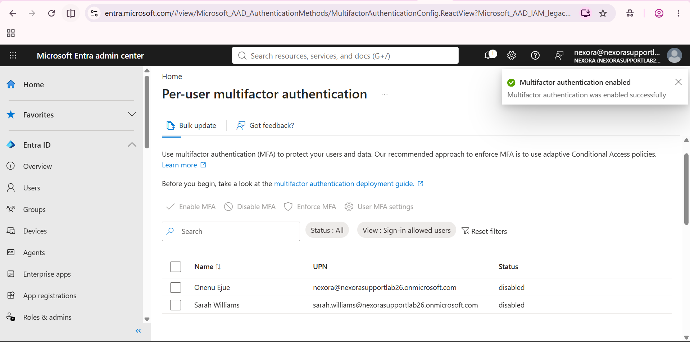
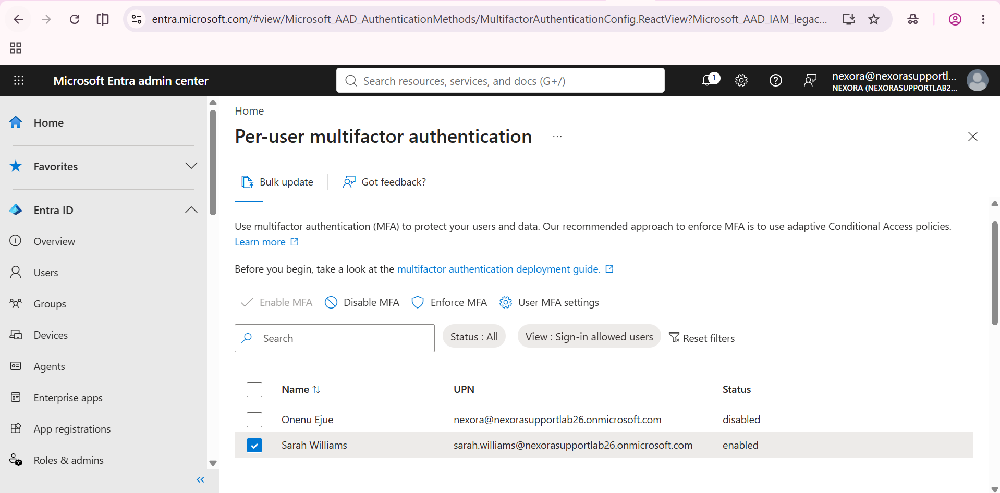

# Enable per-user MFA

The progression shows disabled status, selection, confirmation, a stale list and the refreshed result. Enabled is not the same as enforced or a verified MFA challenge.

## 1. Select the test account

Sarah is selected and her initial MFA status is disabled.

## 2. Review the enablement confirmation

The Enable multifactor authentication dialogue is open for the selected user.

## 3. Observe success with a stale list

The notification says MFA was enabled successfully, while the list still shows disabled.

## 4. Verify the refreshed result

Sarah's row now shows enabled. Registration, enforced status and successful MFA sign-in are not demonstrated.

