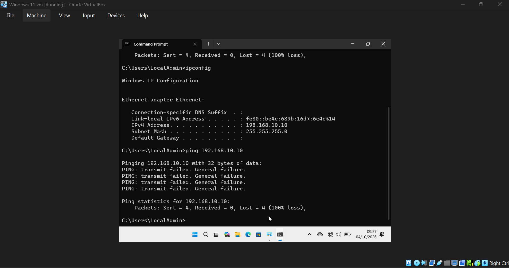
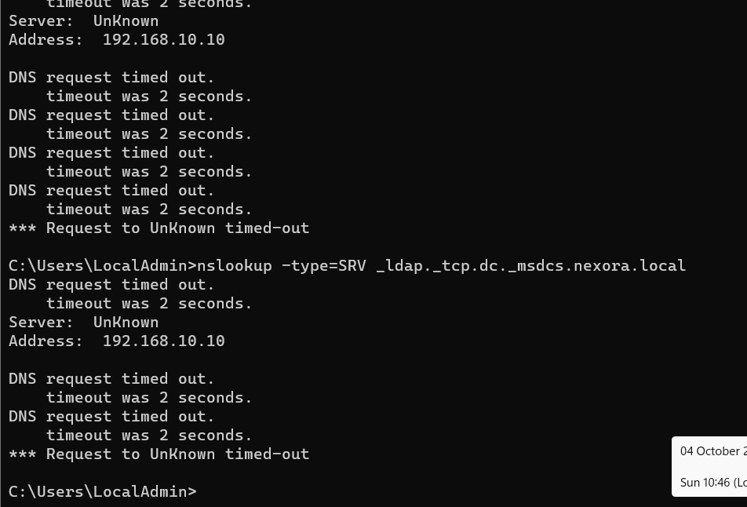
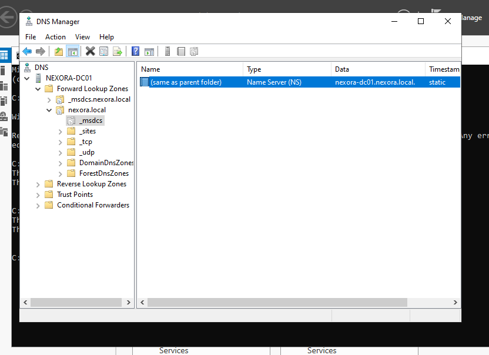
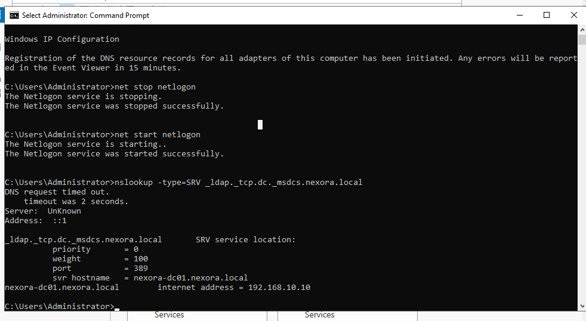
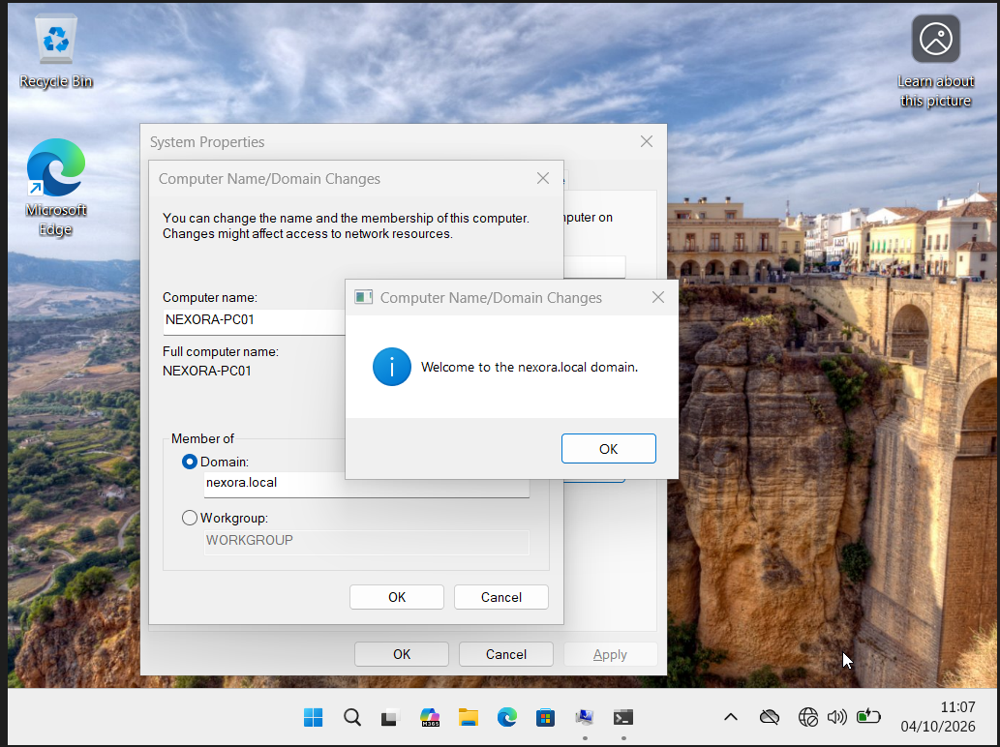

# Investigate domain-controller discovery

The screenshots capture failure, investigation, a returned SRV record and the eventual successful domain join. They do not by themselves establish one exclusive root cause.

## 1. Inspect the initial network failure

ipconfig shows 198.168.10.10, outside the intended 192.168.10.0/24 lab subnet. Ping to 192.168.10.10 returns General failure and 100% loss. This is an initial incorrect configuration, not the final workstation address.

## 2. Observe domain discovery failure

The workstation cannot contact the domain controller for nexora.local.

## 3. Test the domain-controller SRV record

The client SRV lookup times out against DNS server 192.168.10.10.

## 4. Inspect server DNS zones

DNS Manager shows the nexora.local and _msdcs.nexora.local zones.

## 5. Restart Netlogon and inspect the lookup

The server reports DNS registration initiated and successful Netlogon stop/start. An SRV answer returns nexora-dc01.nexora.local on port 389 at 192.168.10.10, although an initial timeout and Unknown server label remain visible.

## 6. Verify the downstream result

The Windows client subsequently joins nexora.local successfully.

