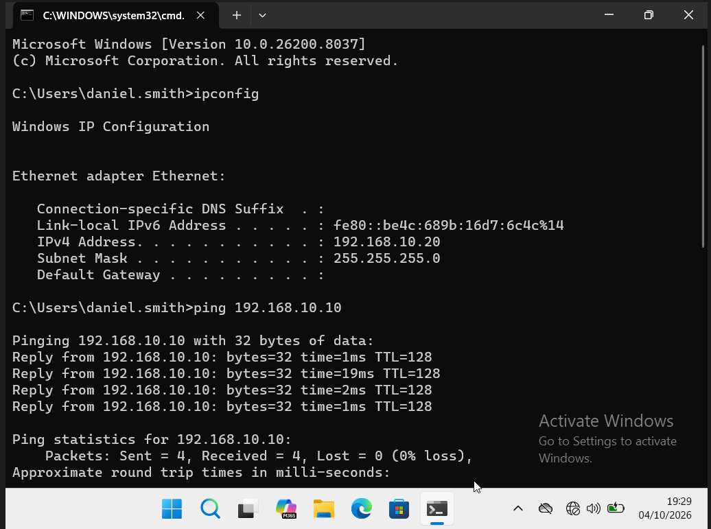
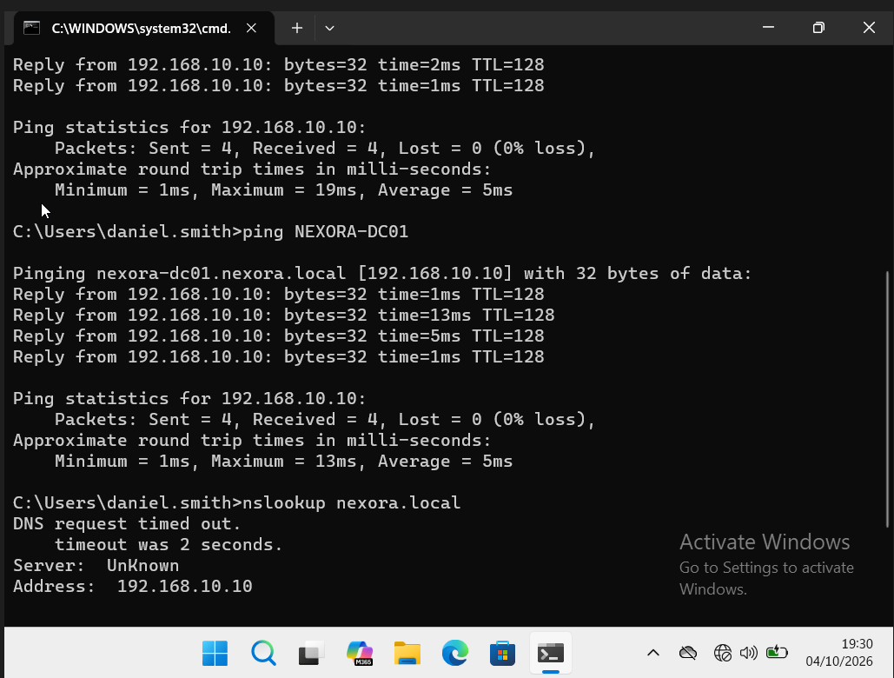
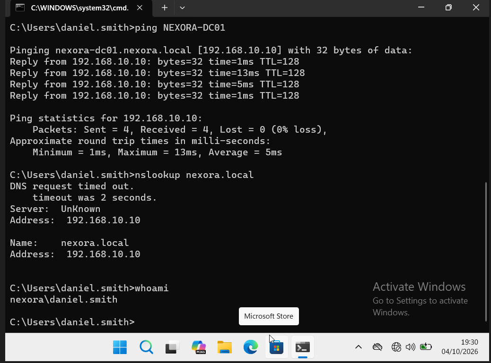

# Verify IP connectivity and DNS

Follow the checks from IP configuration to server reachability, hostname reachability and the final DNS response.

## 1. Check IP configuration and ping the server

The workstation has 192.168.10.20/24 with no default gateway. Ping to 192.168.10.10 receives all four replies, with 0% loss.

## 2. Check hostname reachability and begin DNS lookup

NEXORA-DC01 resolves to nexora-dc01.nexora.local at 192.168.10.10 and receives four replies. The following nslookup initially reports a timeout.

## 3. Read the returned DNS answer and user identity

Despite the initial timeout/Unknown server label, nslookup returns nexora.local at 192.168.10.10. whoami identifies nexora\daniel.smith. This is a returned answer with a warning, not a completely clean DNS test.

