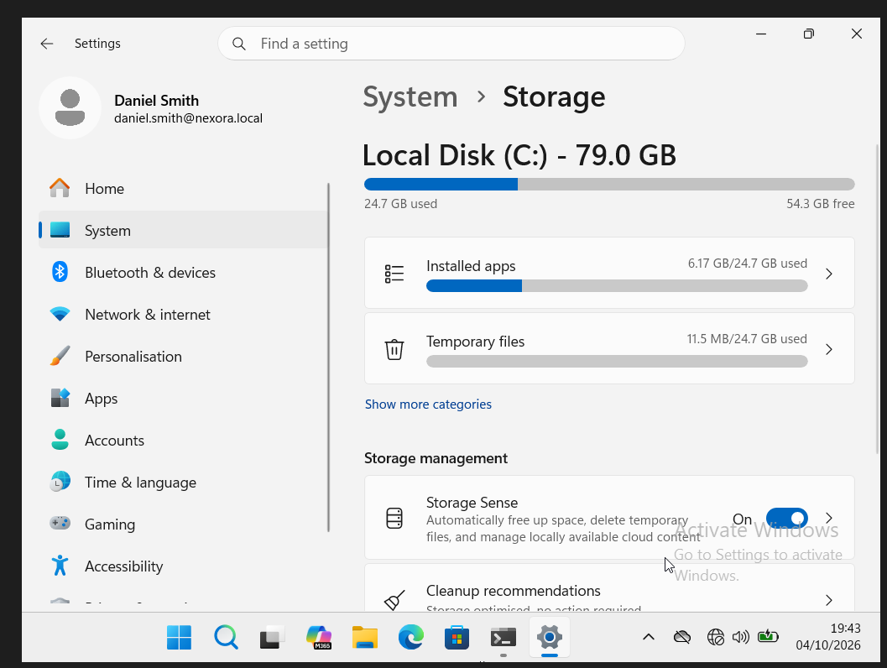
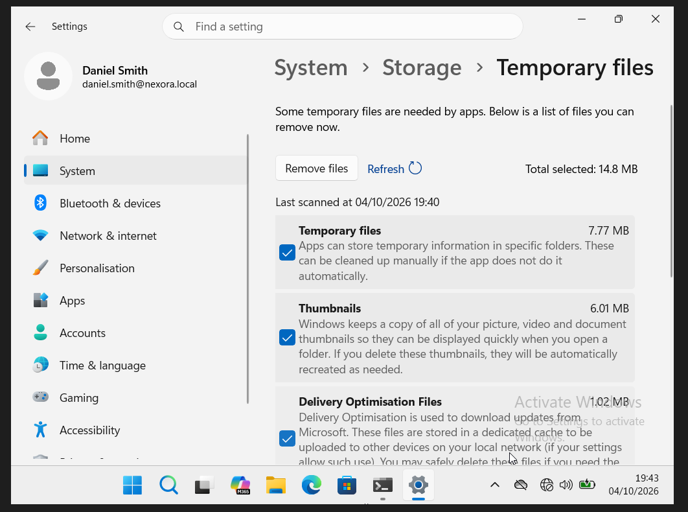
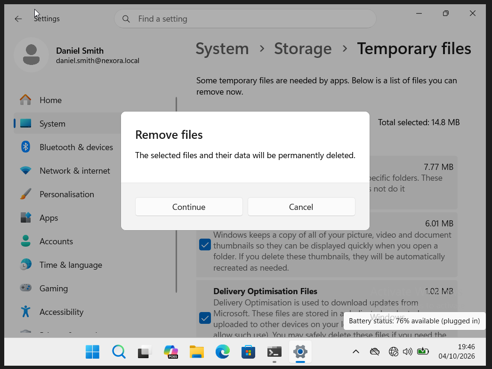
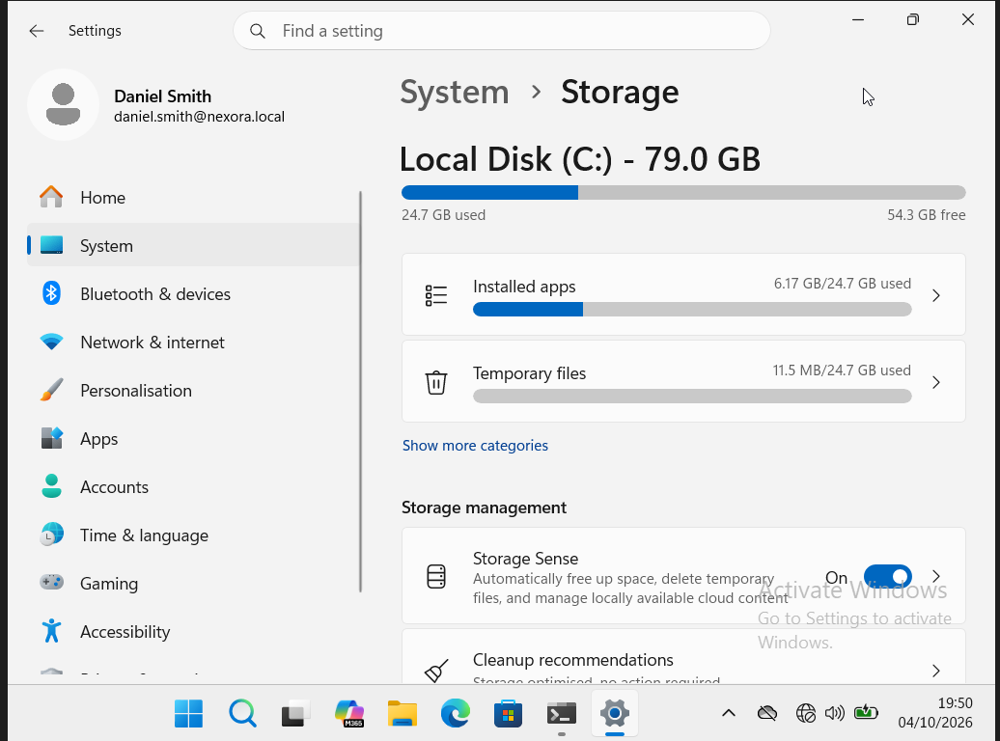

# Review storage and clean temporary files

This was a cleanup practice task. The drive already had ample free space; no production low-disk incident or measured storage saving is claimed.

## 1. Review the initial storage breakdown

The 79.0 GB drive shows 24.7 GB used and 54.3 GB free.

## 2. Select temporary-file categories

Temporary files, thumbnails and Delivery Optimisation Files are selected; the total selected reads 14.8 MB.

## 3. Review removal confirmation

Windows asks for confirmation before permanently deleting the selected files. This image shows the confirmation stage.

## 4. Return to Storage after cleanup

The final view again shows 54.3 GB free at the displayed precision. The conversation records completion; these rounded figures do not establish the amount actually recovered.

