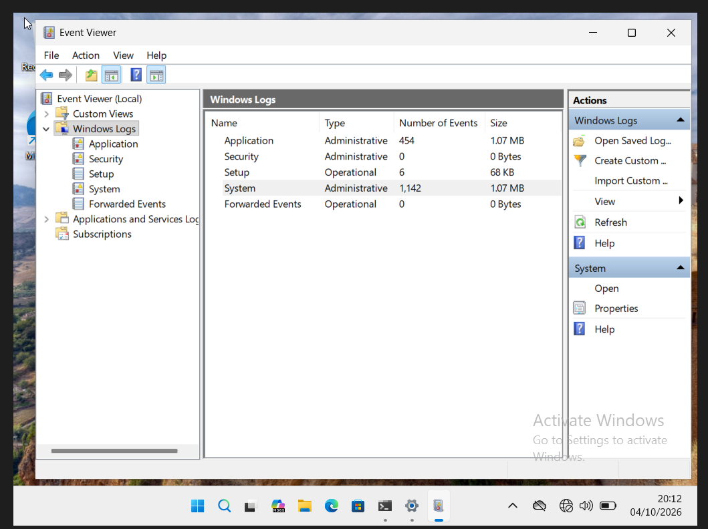
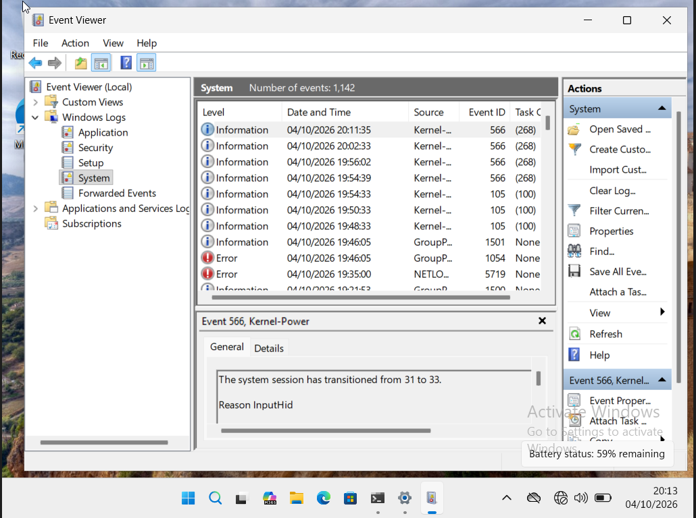
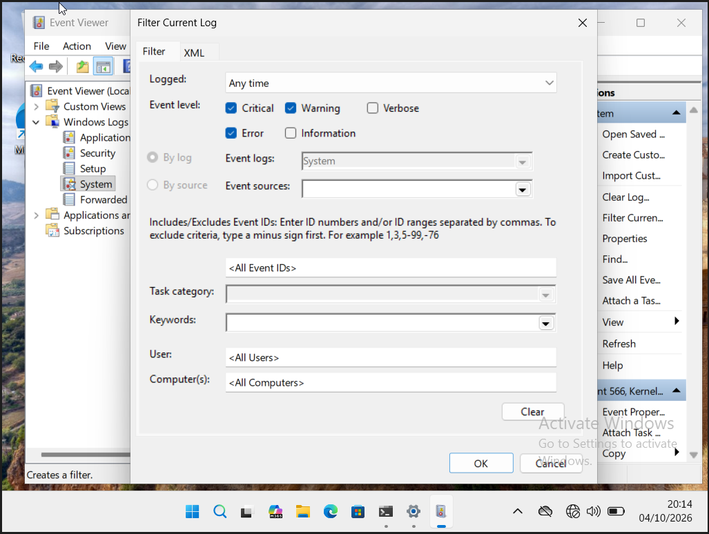
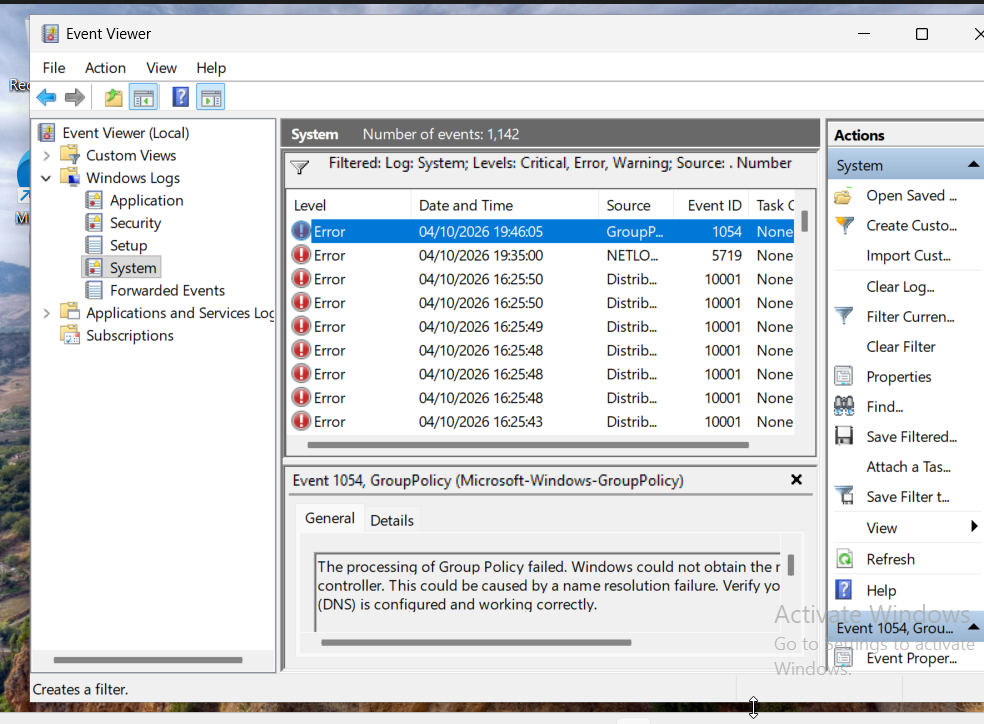
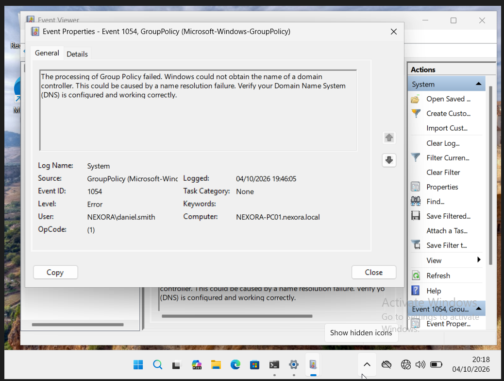
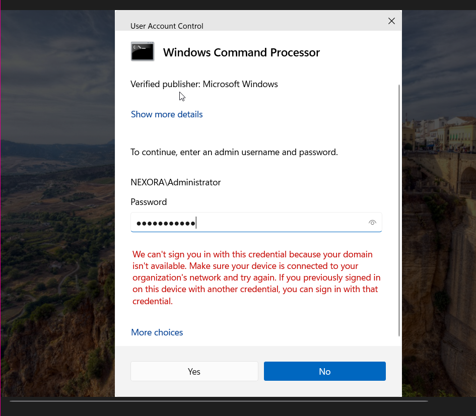

# Investigate a GroupPolicy error

The evidence shows how the System log was narrowed to relevant events and how Event 1054 was interpreted. The later domain-unavailable message remains unresolved in the supplied evidence.

## 1. Locate the System log

Windows Logs lists the System log and its events.

## 2. Inspect the unfiltered events

The System log includes GroupPolicy and NETLOGON errors among information events.

## 3. Filter relevant event levels

Critical, Error and Warning are selected in Filter Current Log.

## 4. Select the GroupPolicy event

The filtered log highlights GroupPolicy Event 1054.

## 5. Read the error details

Event 1054 says Windows could not obtain a domain-controller name and suggests checking DNS/name resolution. The user is NEXORA\daniel.smith and device is NEXORA-PC01.nexora.local.

## 6. Record the follow-up obstacle

An elevation attempt reports that the domain is unavailable. The password is masked. No successful gpupdate or final repair is shown.

